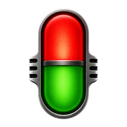
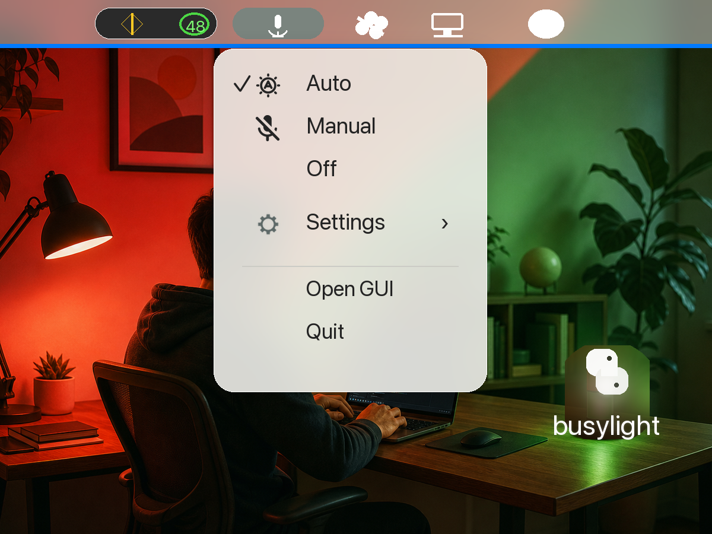

# Busylights

Busylights is a small macOS menu bar app that turns Govee LAN lights into an automatic meeting status light. When your Mac reports that the microphone or camera is active, enabled lights switch to your busy color; when recording stops, they switch back to your available color.

<p align="center">
  
</p>

The menu bar icon stays out of the way until your meeting status changes. The light does the visible signaling: red for busy, green for available, or any colors you choose.

## Features

- macOS menu bar app with Auto, Manual, and Off modes.
- Automatic busy detection from CoreAudio microphone state and CoreMediaIO camera state.
- Govee LAN control, no cloud API key required.
- Multi-device support with per-device enable/disable.
- Configurable busy, available, and manual colors.
- Configurable brightness, including `0%` to turn lights off.
- Optional Tk settings window for scanning devices and editing config.
- Reproducible local `.app` build with PyInstaller.

## Requirements

- macOS 13 or newer.
- Python 3.10 or newer.
- [uv](https://docs.astral.sh/uv/) for dependency management.
- One or more Govee devices with LAN control enabled in the Govee app.
- Your Mac and Govee devices on the same local network.

## Quick Start

```bash
uv sync
uv run busylight --discover
uv run busylight --config
uv run busylight
```

The menu bar app can also be started from source:

```bash
uv run python main.py
```

Open the settings window directly:

```bash
uv run python main.py --gui
```

## Build The macOS App

Build a local app bundle:

```bash
uv sync --extra build
./build_app.sh
```

The built app is written to:

```text
dist/Busylights.app
```

The build script uses PyInstaller, embeds the app icon/assets, patches the macOS bundle metadata, and ad-hoc signs the result for local use.

## Using The App

After launching `Busylights.app`, look for the microphone icon in the macOS menu bar.

- `Auto`: follows microphone/camera activity.
- `Manual`: holds the selected override color.
- `Off`: turns enabled lights off.
- `Settings`: choose colors and brightness levels.
- `Open GUI`: opens the settings window for scanning devices and editing enabled lights.

## Example

Place a Govee lamp or strip where it is visible in your workspace. Busylights can split the room visually: a red busy glow while your mic or camera is active, then a green available glow when the call ends.



## Configuration

Busylights stores local configuration at:

```text
~/.config/busylight/config.json
```

The config contains discovered device identifiers, local IP addresses, enabled/disabled state, selected mode, colors, and brightness levels. Do not commit this file if you copy it into the repo while debugging.

## Troubleshooting

If no devices are found:

- Confirm LAN control is enabled for each light in the Govee app.
- Confirm the Mac and lights are on the same Wi-Fi/VLAN.
- Run `uv run busylight --discover` again.

If the menu bar icon does not appear:

- Quit any old Busylights process.
- Rebuild with `./build_app.sh`.
- Launch `dist/Busylights.app` again.

If lights do not change:

- Re-run `uv run busylight --config` and ensure at least one device is enabled.
- Check that the device IP address has not changed.
- Try setting a manual color from the menu to confirm LAN control works.

## Public Repo Hygiene

This repository intentionally excludes build output, virtual environments, Python caches, macOS metadata, generated PyInstaller specs, and local configuration files. Before publishing, run:

```bash
git status --short
rg -n --hidden --glob '!.git/*' --glob '!.venv/**' --glob '!README.md' --glob '!*.png' --glob '!*.icns' \
  '(api[_-]?key|secret|token|password|Authorization:|Bearer |BEGIN .*PRIVATE KEY)'
```
